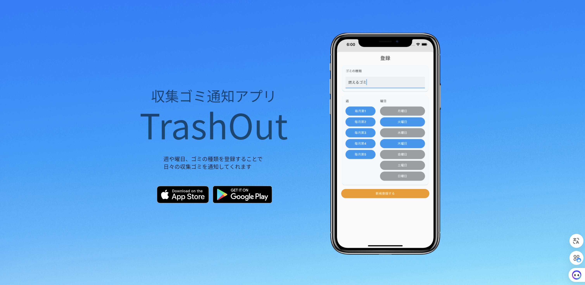

## Hi there 👋

I am Daisuke, a Flutter Engineer based in Okinawa, Japan.
Before becoming an engineer, I spent 8 years as a local government official.
My engineering career started in 2021/12, and I am currently expanding my field into Web front-end and back-end development.

## Resume

- [職務経歴書・スキルシート（Web）](https://resume.hono-my-app.workers.dev)
- [職務経歴書 DOCX](https://resume.hono-my-app.workers.dev/resume.docx)
- [スキルシート DOCX](https://resume.hono-my-app.workers.dev/skillsheet.docx)

## Certificate

- [Meta Back-End Developper Certificate
](https://coursera.org/share/11492afa48c800dabf531159d0f085d2)

## Portfolio

### TrashOut (2022/6)

収集ゴミ通知アプリ。曜日ごとにゴミの種類を登録すると、当日の収集ゴミを通知してくれます。

> ⚠️ LP の初回表示に10秒ほどかかる場合があります。

- [LP を見る](https://trash-out-overview-web.web.app/)

## Hobby
- jogging🏃
- swimming🏊

## Location
The most south of Japan, Okinawa🏝️

## Language
Japanse, Korean, English

<!--
**dai10512/dai10512** is a ✨ _special_ ✨ repository because its `README.md` (this file) appears on your GitHub profile.
-->